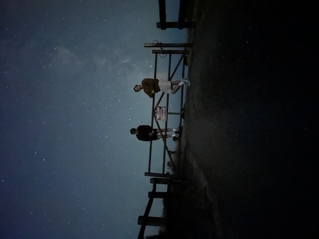
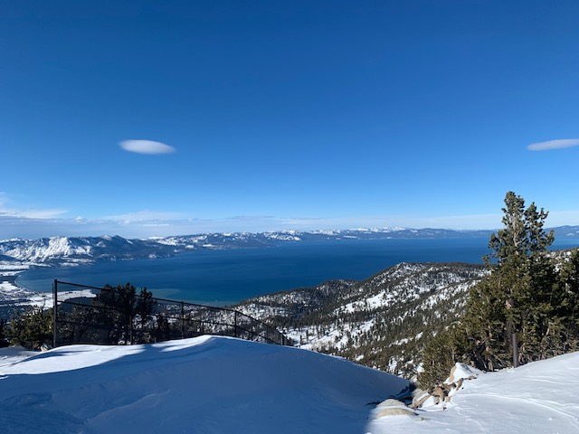

# _Ekin Celik_
Computer Science, _University of California, San Diego_  
Expected Graduation: Spring 2026
[Academic History](/ENCacademicHistory.pdf)

## _Academic Bio_
In Fall of 2023, I transferred from [De Anza College](https://www.deanza.edu/) in Cupertino to [UC San Diego](https://www.deanza.edu/), to persue a degree in Computer Science. I decided to study this field only after I reluctantly took a programming class, with the insistance of my family. I quickly realized that I was talented at coding, and that I enjoyed it, too. After further coursework at De Anza College, including classes like [Data Structures](https://www.deanza.edu/faculty/garbaceadelia/cis22c.html), [Object Oriented Analysis and Design](https://www.deanza.edu/schedule/class-details.html?crn=23076&y=2022&q=F), and [x86 Assembly](https://www.deanza.edu/faculty/nguyenclare/cis21ja.html), I was able and grateful to transfer to UCSD, where I took more advanced coursework. My favorite classes so far include [Advanced Data Structures](https://catalog.ucsd.edu/courses/CSE.html#cse100), [Theory of Computability](https://catalog.ucsd.edu/courses/CSE.html#cse105), and [Introduction to Artificial Intelligence: Search and Reasoning](https://catalog.ucsd.edu/courses/CSE.html#cse150b).  

Some classes that I look forward to are:
-  [Machine Learning: Learning Algorithms](https://catalog.ucsd.edu/courses/CSE.html#cse151a)
-  [Deep Learning](https://catalog.ucsd.edu/courses/CSE.html#cse151b)
-  [Introduction to Modern Cryptography](https://catalog.ucsd.edu/courses/CSE.html#cse107)

My future goals include obtaining a Graduate Level Degree in Computer Science, desireably here at UCSD. I find that I particularly enjoy theory courses, so I expect that I would specialize in that area, with nothing specific in mind yet. I expect to make a well informed decision after I have taken a wider variety of courses.

Academic Goals:
- [x] Attend Prestiguous University[^1]
- [ ] Graduate from said University
  - [x] Maintain High GPA
- [ ] Obtain Masters Degree
- [ ] Obtain Phd(?)[^2]

## _Personal Bio_
I try to push myself to delve deeper into my hobbies, and pick up new ones, as well. I do this because I believe that having talents and interests can greatly improve a person. Even having talents that serve no purpose other than to impress others (e.g. juggling)[^3] ,can still boost confidence, build character, and maintain health.

Some of my Hobbies/Talents Include:
- Snowboarding
- Playing the Keyboard
- Playing the guitar
- Playing the ukelele
- Writing and recording music[^4]
- Playing Lacrosse[^5]
- Taking pictures of [Spooky Places](https://e-celik.github.io/Ekin_Celik/#spooky-pictures-from-around-campus)

## _Gallery_

### Spooky Pictures From Around Campus:


### Assorted Pictures:

Davenport, CA  
  
New Years!  
  
Me and Grandpa  
  
Two of my Buddies and a Million Stars  
  
Me and my Buddy with Similar Jackets[^6]  
  
Lake Tahoe from Heavenly Resort  
  
Clay-Pigeon Shooting at a Range  
  
Surfing Trip with [Outback Adventures](https://recreation.ucsd.edu/adventures/wilderness-orientation/)  


## _More Stuff_

### A quote that I like a lot
From Georges Bizet (composer of _Carmen_):
> As a musician I tell you that if you were to suppress adultery, fanaticism, crime, evil, the supernatural, there would no longer be the means for writing one note.

I like this quote because I agree that there has to be some kind of societal friction in order to make the world an interesting place to live in.  

### A program that I like a lot
An algorithm from the 1999 game: Quake III Arena:
```
float Q_rsqrt(float number)
{
  long i;
  float x2, y;
  const float threehalfs = 1.5F;

  x2 = number * 0.5F;
  y  = number;
  i  = * ( long * ) &y;                       // evil floating point bit level hacking
  i  = 0x5f3759df - ( i >> 1 );               // what the fuck?
  y  = * ( float * ) &i;
  y  = y * ( threehalfs - ( x2 * y * y ) );   // 1st iteration
  // y  = y * ( threehalfs - ( x2 * y * y ) );   // 2nd iteration, this can be removed

  return y;
}
```
The above is a program called the _fast inverse square root_, and it was designed to compute lighting for the graphics of first-person-shooter Quake III Arena. Although the algorithm is now obsolete, due to hardware advancements, I still really enjoy it because it is apparent that the programmer is knowledgable about mathematical approximations, floating point representations, and has a great sense of humor.


### Notes:
[^1]: (Prestiguous enough)
[^2]: It's too early to make this decision.
[^3]: I cannot juggle.
[^4]: Started recently, still learning
[^5]: Played LSM in High School and College
[^6]: "Jackets are the eyes to the soul" -Julian Casablancas of The Voidz
